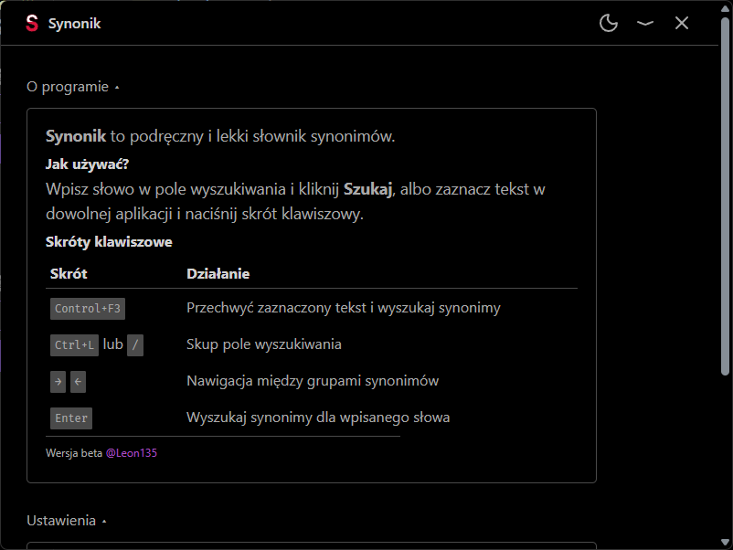
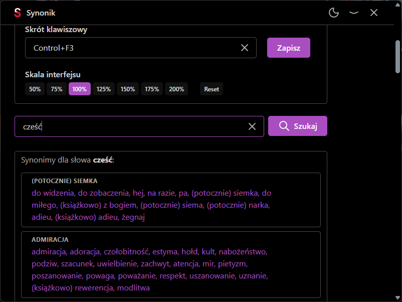
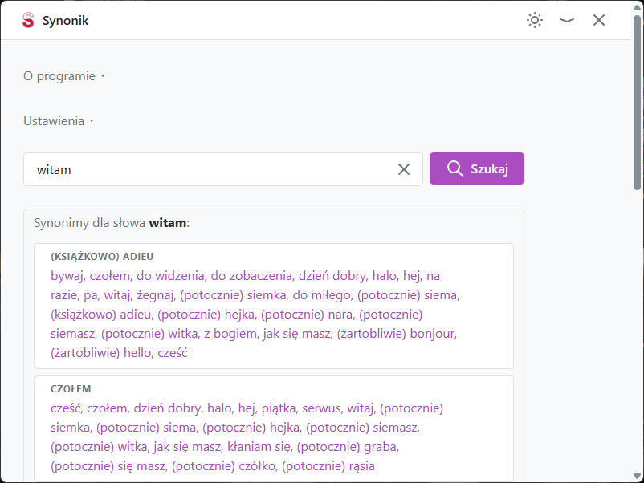

# Synonik

> A lightweight Polish synonym dictionary for your desktop.

Select a word, press a shortcut, and get synonyms instantly. Or search it in ui. Written in Rust + Tauri so it's crazy fast and lightweit. Database is large, but it is only loaded on search, not in RAM.

## Features

- Fast and lightweight
- Synonym lookup from a local SQLite database
- Global customizable hotkey (default `Ctrl+F2`) — select text, press the shortcut, see synonyms
- In app shortcuts
- Dark/light theme toggle with persistence
- Windows system accent color detection
- System tray icon: show, autostart, quit
- Custom titlebar with minimize/close buttons
- Tray icon
- Full Polish UI

## Screenshots

Primary color is based on Windows accent color.







## Download

Go to the [Releases](https://github.com/Leon135/Synonik/releases) page and grab the latest installer.

## Roadmap

Things I might do someday, in no particular order:

- Synonym group meanings (Bielik-based?)
- Add own synonyms, groups, meanings
- Delete synonyms
- Send suggestions / feedback from the UI
- App updates
- Database updates with custom entry preservation
- Linux / macOS support
- Search history
- Search-as-you-type
- Click a synonym to search it
- Release build pipeline (GitHub Actions)
- Support for other languages (starting with English)

## Development

### Requirements

- [Bun](https://bun.sh/) (development)
- [Rust](https://www.rust-lang.org/) (to compile the backend)

### Quick start

```sh
bun install
cd src-tauri && cargo check && cd ..
bun tauri dev
```

### Build

```sh
bun run build
```

The installer will be in `src-tauri/target/release/bundle/`.

### Scripts

| Command | Description |
|---------|-------------|
| `bun dev` | Start Vite dev server |
| `bun build` | TypeScript + Vite build |
| `bun lint` | Biome check (format + lint) |
| `bun lint:fix` | Biome auto-fix everything |
| `bun tauri dev` | Run app in dev mode |
| `bun tauri build` | Build installer bundle |

### Stack

- **Frontend:** Vite + Preact + TypeScript + Open Props
- **Backend:** Tauri + Rust + Diesel + SQLite
- **Quality:** Biome (lint + format), cargo check

## License

Copyright (c) 2026 Leon135.

This project is licensed under the **Apache License 2.0**.

---

**Built with 💜 by [Leon135](https://leon135.xyz)**
