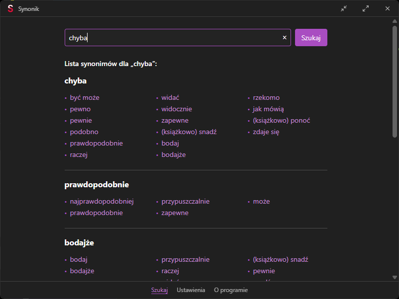
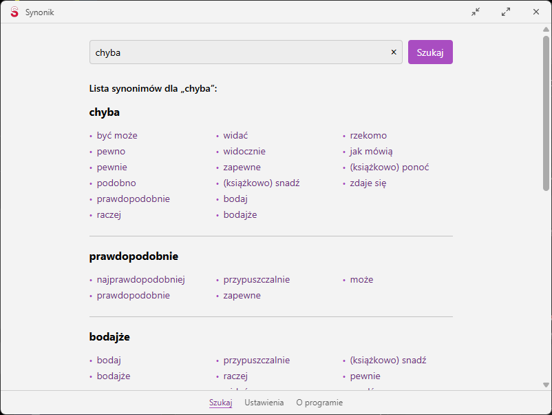
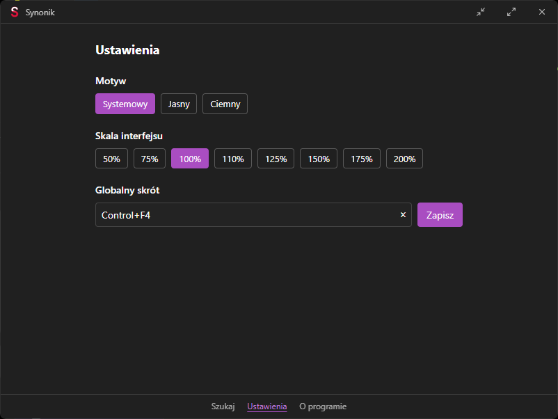
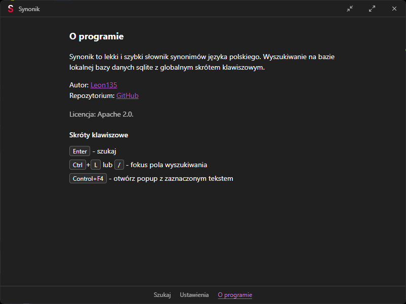

# Synonik

> A lightweight Polish synonym dictionary for your desktop.

Synonik ("synonim" - synonym + "słownik" - dictionary)

**I've always struggled with repeating the same words over and over when writing. I wanted a way to quickly find synonyms without opening a browser, so I built Synonik.**

Select a word, press a shortcut, and get synonyms instantly. Or search directly in the app. Written in Rust + Tauri so it's fast and lightweight. The database is large, but it is only queried on search, not kept in RAM.

## Features

- Fast and lightweight
- Synonym lookup from a local SQLite database
- Global customizable hotkey (default `Ctrl+F2`) — select text, press the shortcut, see synonyms
- In-app shortcuts: `Enter` to search, `Ctrl+L` or `/` to focus the search field
- Click a synonym to search it
- Dark / light / system theme with persistence
- System accent color detection (Windows + GNOME)
- Interface scale presets (50–200%) with persistence
- System tray icon: show, autostart, quit
- Linux support (AppImage; X11 should work without issues; on Wayland the primary selection is used)
- Custom titlebar with minimize/close buttons
- Full Polish UI

## Screenshots

Primary color is based on the system accent color (Windows or GNOME on Linux).









## Download

Go to the [Releases](https://github.com/Leon135/Synonik/releases) page and grab the latest Windows installer or Linux AppImage.

## Roadmap

Things I might do someday, in no particular order:

- Synonym group meanings (Bielik-based?)
- Add own synonyms, groups, meanings
- Delete synonyms
- Send suggestions / feedback from the UI
- App updates
- Database updates with custom entry preservation
- Search history
- Search-as-you-type
- Support for other languages (starting with English)

## Development

Database builder is here: [Github repo](https://github.com/Leon135/Synonik-db-builder)

### Requirements

- [Bun](https://bun.sh/) (development)
- [Rust](https://www.rust-lang.org/) (to compile the backend)

### Quick start

```sh
bun install
cd src-tauri && cargo check && cd ..
bun tauri dev
```

### Build

```sh
bun run tauri build
```

The installer will be in `src-tauri/target/release/bundle/`.

### Scripts

| Command                | Description                                                     |
| ---------------------- | --------------------------------------------------------------- |
| `bun dev`              | Start Vite dev server                                           |
| `bun run build`        | TypeScript + Vite build                                         |
| `bun release <semver>` | Bump version in `package.json`, `tauri.conf.json`, `Cargo.toml` |
| `bun lint`             | ESLint + Prettier check (format + lint)                         |
| `bun lint:fix`         | ESLint + Prettier auto-fix everything                           |
| `bun format`           | Prettier format only                                            |
| `bun tauri dev`        | Run app in dev mode                                             |
| `bun tauri build`      | Build installer bundle                                          |

### Stack

- **Frontend:** Vite + Vue + TypeScript
- **Backend:** Tauri + Rust + Diesel + SQLite
- **Quality:** ESLint + Prettier (lint + format), cargo check

## License

Copyright (c) 2026 Leon135.

This project is licensed under the **Apache License 2.0**.

---

**Built with 💜 by [Leon135](https://leon135.xyz)**
